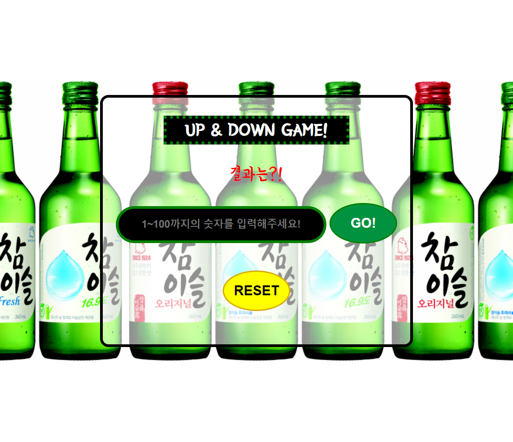

# number-game

술 게임인 Up Down게임 입니다.

## 기능

- 컴퓨터는 게임이 시작할 때 랜덤한 숫자를 뽑는다.
- 유저는 총 5번, 1~100까지의 숫자를 입력할 수 있다.
- 유저가 입력한 숫자가 랜덤한 숫자보다 작으면 Up이라고 표시하고 크다면 Down이라고 알려준다.
- 기회를 다 소진하거나 정답을 맞출 경우 게임이 종료되며 버튼이 비활성화 된다.
- 1~100범위 밖의 숫자를 입력시 경고 메세지가 보여진다.
- 유저가 이미 입력한 값을 또 입력 시 경고메세지가 보여진다.
- 리셋 버튼 클릭시 게임이 초기화된다.

## 사용한 기술
- HTML
- SCSS
- Vanila Javascript